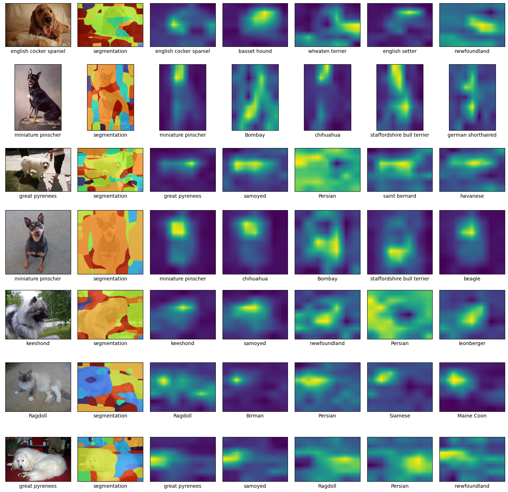
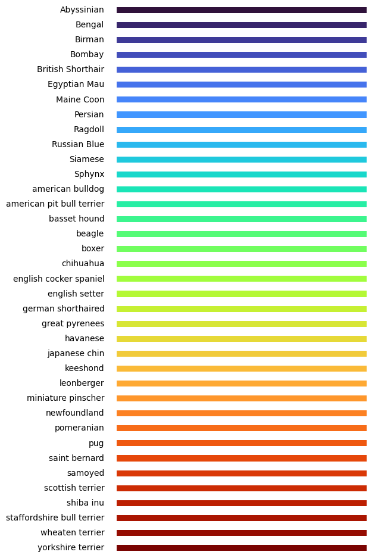

# DenseCLIP

An unofficial implementation for paper "DenseCLIP: Extract Free Dense Labels from CLIP".

## Examples on Oxford-IIIT Pet dataset

Original image, segmentation, and top-5 confidence map of DenseClip

### Segmentation Color Table

## Issues

- ~~Encoding for each template cost 2 GB memory. 85 templates may consume 170 GB memory.~~ (resolved)

